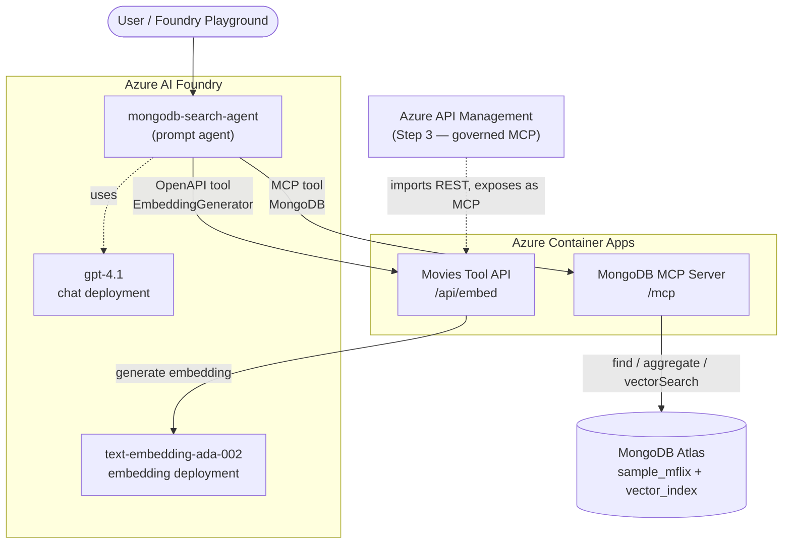

# Simple RAG on Movies — MongoDB Vector Search Agent with Azure AI Foundry

[← Back to all samples](../../README.md)

Build an intelligent agent that performs semantic search over MongoDB movie data using Azure AI Foundry and the MongoDB MCP Server.

## 🧭 Workshop Progression

This sample is built in steps. Provision Foundry first, then build the base agent, then layer on evaluations and an API gateway:

| Step | Folder | What you add |
|------|--------|--------------|
| **0. Foundry setup** | [`00-foundry-setup/`](./00-foundry-setup/) | Provision the Azure AI Foundry account + project and deploy the `gpt-4.1` (chat) and `text-embedding-ada-002` (embedding) models. |
| **1. Base agent** | *(this folder)* | A Foundry agent with the **EmbeddingGenerator** (OpenAPI) and **MongoDB** (MCP) tools doing vector + structured search. |
| **2. Evaluations** | [`02-evals/`](./02-evals/) | Portal-visible agent evaluations (tool-call accuracy, relevance, and more). |
| **3. APIM MCP gateway** | [`03-apim-mcp-gateway/`](./03-apim-mcp-gateway/) | Put the API behind Azure API Management and expose it as a governed MCP server. |

Follow the steps in order — each builds on the previous one.

## What You'll Build

A hosted AI agent in Azure AI Foundry that can:
- **Semantic Search**: Find documents by meaning, not just keywords ("movies about hope and redemption")
- **Direct Queries**: Filter by specific fields (year, genre, cast)
- **Aggregations**: Get statistics, top results, counts

## Architecture



> **Models come from your Azure AI Foundry resource.** The Foundry project's underlying
> AI Services resource hosts your model deployments — the agent's chat model (e.g. `gpt-4.1`)
> **and** the embedding model. You do **not** need a separate Azure OpenAI resource; the Foundry
> endpoint is Azure OpenAI–compatible, so the Movies Tool API calls it with the same
> `AZURE_OPENAI_*` settings.

### Two backend Container Apps

The base agent has **two separate backend services**, deployed by two templates. Don't confuse them:

| Backend | Deployed by | Image | Agent tool | What it does |
|---------|-------------|-------|------------|--------------|
| **MongoDB MCP Server** | [`deploy/mcp-server/`](./deploy/mcp-server/) | `mongodb/mongodb-mcp-server` (official) | **MongoDB** (MCP tool) | All MongoDB queries — `find`, `aggregate`, `$vectorSearch` — over the MCP protocol |
| **Movies Tool API** | [`deploy/movies-api/`](./deploy/movies-api/) (or `az containerapp up`) | custom `server.py` | **EmbeddingGenerator** (OpenAPI tool) | Generates embeddings at `/api/embed` for semantic search |

So in the base agent:
- **Direct / aggregation / vector queries** → **MongoDB** MCP tool → MCP Server → MongoDB Atlas.
- **Embeddings for semantic search** → **EmbeddingGenerator** OpenAPI tool → Movies Tool API `/api/embed` → Foundry embedding model.

> The Movies Tool API *also* has `/api/mongo/*` REST routes, but the **base agent does not use them** —
> MongoDB is reached only through the MCP Server. Those REST routes exist solely for
> [Step 3 — APIM](./03-apim-mcp-gateway/), which imports them and re-exposes the whole API as one MCP server.

## Prerequisites

- [Azure Subscription](https://azure.microsoft.com/free/)
- **Azure AI Foundry account + project with two model deployments.** Deploy these in
  [Step 0 — Foundry setup](./00-foundry-setup/) (or use an existing project that already has):
  - a **chat** model for the agent (e.g. `gpt-4.1`)
  - an **embedding** model for semantic search (e.g. `text-embedding-ada-002`)
- [MongoDB Atlas](https://www.mongodb.com/cloud/atlas) — create via [Azure Native Integration](#option-a-create-mongodb-atlas-via-azure-native-integration) (recommended) or [Atlas Portal](#option-b-create-mongodb-atlas-via-atlas-portal), with:
  - `sample_mflix` sample database loaded
  - Vector search index created (see [MongoDB Atlas Setup](#mongodb-atlas-setup))
- [Azure CLI](https://docs.microsoft.com/cli/azure/install-azure-cli) (with the `containerapp` extension; `az` installs it on first use)

## MongoDB Atlas Setup

> **Do this before Quick Start.** The deployment steps below need a MongoDB Atlas cluster that
> already has the `sample_mflix` data loaded and the `vector_index` created — plus its connection
> string. Set that up here first.

You can provision MongoDB Atlas in two ways:
- **Option A** — [Azure Native Integration](#option-a-create-mongodb-atlas-via-azure-native-integration) (recommended): Create and manage MongoDB Atlas directly from the Azure portal, with unified billing on your Azure invoice.
- **Option B** — [MongoDB Atlas Portal](#option-b-create-mongodb-atlas-via-atlas-portal): Create a cluster directly on [cloud.mongodb.com](https://cloud.mongodb.com).

Both options produce the same result — a MongoDB Atlas cluster with sample data and a vector search index. Choose whichever fits your workflow.

---

### Option A: Create MongoDB Atlas via Azure Native Integration

> **Why this approach?** Azure Native Integration lets you provision, manage, and monitor MongoDB Atlas as a first-class Azure resource. Billing is consolidated into your Azure invoice, and you can use Azure RBAC, tags, and resource groups to manage the resource alongside your other Azure services.

#### Prerequisites
- An active [Azure subscription](https://azure.microsoft.com/free/) with **Owner** or **Contributor** role
- (Optional) An existing [MongoDB Atlas account](https://www.mongodb.com/cloud/atlas) — one will be linked or created during setup

#### Step 1: Create the MongoDB Atlas Resource in Azure Portal

1. Sign in to the [Azure portal](https://portal.azure.com)
2. Click **Create a resource** (or search for **MongoDB Atlas** in the top search bar)
3. Select **MongoDB Atlas (Azure Native ISV Service)** from the Marketplace results
4. Click **Create** and fill in the **Basics** tab:

   | Field | Value |
   |---|---|
   | **Subscription** | Select your Azure subscription |
   | **Resource group** | Use an existing one or create new (e.g., `mongodb-agent-rg`) |
   | **Resource name** | A globally unique name for your Atlas resource |
   | **Region** | Select the Azure region (e.g., `East US`) |
   | **Organization name** | Your MongoDB Atlas organization name |

5. (Optional) Add **Tags** for resource management
6. Click **Review + create** → **Create**
7. Wait for deployment to complete, then click **Go to resource**

#### Step 2: Set Up Your Cluster in Atlas

1. On the resource overview page, click **Go to MongoDB Atlas** — this opens the Atlas portal linked to your Azure account
2. If you don't already have a cluster, create one:
   - Select **Build a Cluster** → choose **M0 (Free)** tier for testing
   - Select the same Azure region as your resource for lowest latency
   - Click **Create Cluster**

#### Step 3: Load Sample Data

1. In the Atlas portal, find your cluster and click **...** (ellipsis menu)
2. Select **Load Sample Dataset**
3. Wait for the `sample_mflix` database to load (this takes a few minutes)

#### Step 4: Create Vector Search Index

1. Go to **Atlas Search** → **Create Search Index**
2. Select **JSON Editor**
3. Choose database: `sample_mflix`, collection: `embedded_movies`
4. Index name: `vector_index`
5. Paste this definition:

```json
{
  "fields": [
    {
      "type": "vector",
      "path": "plot_embedding",
      "numDimensions": 1536,
      "similarity": "cosine"
    }
  ]
}
```

6. Click **Create Search Index**
7. Wait for the index status to show **Active**

#### Step 5: Get Connection String

1. Go back to your cluster and click **Connect**
2. Select **Drivers**
3. Copy the connection string
4. Replace `<password>` with your database user password

> **Tip:** You can also find connection details from the Azure portal resource page under **Connection strings**.

#### Additional Resources

- [Quickstart: Create a MongoDB Atlas resource in Azure](https://learn.microsoft.com/azure/partner-solutions/mongodb-atlas/create)
- [Manage MongoDB Atlas through Azure](https://learn.microsoft.com/azure/partner-solutions/mongodb-atlas/manage)

---

### Option B: Create MongoDB Atlas via Atlas Portal

If you prefer to use the MongoDB Atlas portal directly (or already have an existing cluster):

#### Load Sample Data

1. Log in to [MongoDB Atlas](https://cloud.mongodb.com)
2. Create a cluster (M0 free tier works)
3. Click **...** → **Load Sample Dataset**
4. Wait for `sample_mflix` database to load

#### Create Vector Search Index

1. Go to **Atlas Search** → **Create Search Index**
2. Select **JSON Editor**
3. Choose database: `sample_mflix`, collection: `embedded_movies`
4. Index name: `vector_index`
5. Paste this definition:

```json
{
  "fields": [
    {
      "type": "vector",
      "path": "plot_embedding",
      "numDimensions": 1536,
      "similarity": "cosine"
    }
  ]
}
```

6. Click **Create Search Index**

#### Get Connection String

1. Click **Connect** on your cluster
2. Select **Drivers**
3. Copy the connection string
4. Replace `<password>` with your database user password

## Quick Start

> ### ⚡ Fast path (one command)
> In a hurry? After completing [Step 0 — Foundry setup](./00-foundry-setup/), a single script deploys
> **both** Container Apps (MongoDB MCP Server + Movies Tool API) and prints the two URLs you need for
> the agent. Then skip straight to [Step 5 — Create the Agent](#5-create-the-agent-in-azure-ai-foundry).
>
> ```powershell
> # from samples/simple-rag-movies
> ./scripts/deploy.ps1 `
>   -ResourceGroup mongodb-agent-rg `
>   -Location eastus `
>   -MongoDBConnectionString "<your MongoDB connection string>" `
>   -AzureOpenAIEndpoint "<foundry accountEndpoint from Step 0>" `
>   -AzureOpenAIKey "<foundry key>" `
>   -EmbeddingModel "text-embedding-ada-002"
> ```
>
> ```bash
> # Bash equivalent (prompts for values)
> ./scripts/deploy.sh
> ```
>
> Prefer to understand each piece? Follow the manual steps below instead — they do exactly what the
> script does, one resource at a time.

### 1. Navigate

```bash
cd mongodb-foundry-agent/samples/simple-rag-movies
```

> **Provision Foundry first.** If you haven't already, complete [Step 0 — Foundry setup](./00-foundry-setup/)
> so you have a Foundry project with `gpt-4.1` and an embedding deployment. Note the resource
> group you use below — this guide uses `mongodb-agent-rg`.

### 2. Get your MongoDB connection string

From MongoDB Atlas: **Connect → Drivers → copy the connection string**, and replace `<password>`
with your database user's password. (If you created Atlas through the Azure Native integration,
open the Atlas portal from the Azure resource to get the same string.)

Store it in an environment variable so it never appears inline in commands or logs:

```powershell
$env:MDB_CONNECTION_STRING = "<paste your MongoDB connection string>"
```

> Tip: use a **read-only** database user for the workshop.

### 3. Deploy the MongoDB MCP Server

```powershell
# Login to Azure
az login

# Create resource group
az group create --name mongodb-agent-rg --location eastus

# Deploy MCP Server (Azure Container Apps)
az deployment group create `
  --resource-group mongodb-agent-rg `
  --template-file deploy/mcp-server/main.bicep `
  --parameters mdbConnectionString="$env:MDB_CONNECTION_STRING"
```

Note the MCP Server URL from the output: `https://<app-name>.<region>.azurecontainerapps.io/mcp`

> **Verify the MCP tools (optional):** list the tools the server exposes with
> `./scripts/list-mcp-tools.ps1 -McpUrl "https://<app-name>.<region>.azurecontainerapps.io/mcp"`
> — you should see `find`, `aggregate`, `count`, and more.

### 4. Deploy the Movies Tool API (Azure Container Apps)

The embedding + MongoDB REST API runs as a container built from
[`src/movies-api`](./src/movies-api) (Flask `server.py` + `Dockerfile`). It exposes
`/api/embed`, `/api/mongo/vector-search`, `/api/mongo/find`, `/api/mongo/aggregate`, and `/api/health`.

> **Which endpoints does the agent use?** In this base step the agent only calls **`/api/embed`**
> via its OpenAPI tool (see [openapi-schema.json](./docs/openapi-schema.json), which lists only that
> one operation). The `/api/mongo/*` endpoints are unused here — they become the REST backend that
> [Step 3 — APIM](./03-apim-mcp-gateway/) imports and re-exposes as a governed MCP server. MongoDB in
> the base agent is reached through the separate **MongoDB MCP** tool, not these REST routes.

First capture your Foundry endpoint and key (from the Step 0 resource):

```powershell
$rg = "mongodb-agent-rg"
$foundryName = "<your-foundry-account-name>"   # e.g. the accountName output from Step 0

$env:AZURE_OPENAI_ENDPOINT = az cognitiveservices account show `
  --resource-group $rg --name $foundryName --query properties.endpoint -o tsv
$env:AZURE_OPENAI_API_KEY = az cognitiveservices account keys list `
  --resource-group $rg --name $foundryName --query key1 -o tsv
```

Then build + deploy the Container App **from source** in one command (Azure builds the image in the
cloud — no local Docker required):

```powershell
cd src/movies-api

az containerapp up `
  --name movies-tool-api `
  --resource-group $rg `
  --location eastus `
  --source . `
  --target-port 8080 `
  --ingress external `
  --env-vars `
    AZURE_OPENAI_ENDPOINT="$env:AZURE_OPENAI_ENDPOINT" `
    AZURE_OPENAI_API_KEY="$env:AZURE_OPENAI_API_KEY" `
    EMBEDDING_MODEL="text-embedding-ada-002" `
    MONGODB_CONNECTION_STRING="$env:MDB_CONNECTION_STRING"

cd ../..
```

Note the application URL from the output, then verify it's healthy:

```powershell
curl.exe "https://<your-movies-tool-api-fqdn>/api/health"
```

The OpenAPI tool server URL you'll use in the next step is: `https://<your-movies-tool-api-fqdn>/api`

> **Infrastructure-as-code alternative:** if you prefer Bicep (and have already pushed the image to a
> registry), use [`deploy/movies-api/main.bicep`](./deploy/movies-api/main.bicep) instead of `az containerapp up`.

### 5. Create the Agent in Azure AI Foundry

> **Access check:** to create and test agents you need the **Azure AI Developer** role on the
> Foundry **project** (Owner/Contributor on the subscription is not sufficient on its own). If the
> portal shows a permissions error like `does not have permissions for
> Microsoft.MachineLearningServices/workspaces/agents/read`, ask an admin to grant you
> **Azure AI Developer** on the project, then retry. This step is done in the **portal** (manual).

1. Go to [Azure AI Foundry](https://ai.azure.com)
2. Open your project
3. Navigate to **Agents** → **+ New Agent**
4. Configure:
   - **Name**: `mongodb-search-agent`
   - **Model**: `gpt-4.1` (or your deployed model)
   - **Instructions**: Copy from [agent-instructions.md](./docs/agent-instructions.md)

5. Add **OpenAPI Tool** (Embedding Generator):
   - Name: `EmbeddingGenerator`
   - Description: `Generates embeddings for semantic search`
   - Authentication: `Anonymous`
   - Schema: Copy from [openapi-schema.json](./docs/openapi-schema.json) and **replace the `servers.url`
     placeholder** (`https://<your-movies-tool-api-fqdn>/api`) with your actual Movies Tool API URL.

6. Add **MCP Tool** (MongoDB):
   - Name: `MongoDB`
   - URL: `https://<your-mcp-server>.azurecontainerapps.io/mcp`
   - **Approval:** set the tool's approval mode to **Never require approval** / **Always allow**.
     Otherwise the [Step 2 evaluations](./02-evals/) stall on `mcp_approval_request` and return no answer.

7. Click **Create**

> **Optional — enable tracing:** on the agent's **Traces** tab, click **Connect** to attach an
> Application Insights resource. Once connected, each run shows a trace of the tool calls
> (EmbeddingGenerator → MongoDB) with latencies and token usage — a nice way to visualize the flow.

### 6. Test Your Agent

Try these queries in the Foundry playground:
- "Find movies about hope and redemption"
- "Show me movies from 1994"
- "What are the top 10 highest rated sci-fi movies?"

See [sample-queries.md](./sample-queries.md) for more examples.

## ➡️ Next Steps

You've built the base agent. Continue the workshop:

| Step | Folder | What you add |
|------|--------|--------------|
| **2. Evaluations** | [`02-evals/`](./02-evals/) | Run portal-visible agent evaluations — tool-call accuracy, relevance, and more. |
| **3. APIM MCP gateway** | [`03-apim-mcp-gateway/`](./03-apim-mcp-gateway/) | Put the API behind Azure API Management and expose it as a governed MCP server. |

➡️ Next: [Step 2 — Evaluations](./02-evals/)

## Sample Structure

```
simple-rag-movies/
├── README.md                          # This file (base agent + workshop guide)
├── sample-queries.md                  # Example queries to test
├── src/
│   └── movies-api/                    # Movies Tool API source (Flask server.py + Dockerfile)
├── deploy/
│   ├── mcp-server/                    # MongoDB MCP Server (Container Apps) deployment
│   └── movies-api/                    # Movies Tool API (Container Apps) Bicep
├── docs/                              # Architecture, agent instructions, OpenAPI spec
├── scripts/                           # deploy.sh / deploy.ps1
├── 00-foundry-setup/                  # Step 0: provision Foundry + model deployments
├── 02-evals/                          # Step 2: agent evaluations
└── 03-apim-mcp-gateway/               # Step 3: expose the API as an MCP server via APIM
```

## Configuration Options

### Movies Tool API (Container App)

| Setting | Description | Default |
|---------|-------------|---------|
| `AZURE_OPENAI_ENDPOINT` | Azure AI Foundry resource endpoint (Azure OpenAI–compatible) | Required |
| `AZURE_OPENAI_API_KEY` | A key for the Foundry resource | Required |
| `EMBEDDING_MODEL` | Embedding model deployment name in the Foundry project | `text-embedding-ada-002` |

### MCP Server

| Setting | Description | Default |
|---------|-------------|---------|
| `MDB_MCP_CONNECTION_STRING` | MongoDB connection string | Required |
| `MDB_MCP_READ_ONLY` | Restrict to read operations | `true` |
| `MDB_MCP_HTTP_PORT` | HTTP port | `8080` |

## Cost Estimate

| Component | Tier | Estimated Cost |
|-----------|------|----------------|
| Container App (Movies Tool API) | Consumption | ~$0-5/month |
| Container App (MCP) | Consumption | ~$0-5/month |
| Azure AI Foundry (embeddings) | Pay-as-you-go | ~$0.0001/1K tokens |
| MongoDB Atlas | M0 | Free |
| **Total** | | **~$0-10/month** |

## Troubleshooting

### Container Apps deployment fails with `AKSCapacityHeavyUsage`
The Container Apps environment couldn't be created because the region is at capacity, e.g.:
`AKS is experiencing heavy usage in region eastus`. Options:
- **Retry** the deployment a little later.
- **Use a different region** — pass `-Location <region>` to the deploy script, or `--location <region>`
  to `az containerapp up` (e.g. `swedencentral`, `westus3`). Keep all resources in the same region.
- If your workshop provides a pre-created Container Apps managed environment, reuse it.

### `az containerapp up` fails on ACR login right after creating the registry
A transient DNS/propagation issue (`lookup <acr>.azurecr.io: no such host`) can occur immediately
after `az containerapp up` creates a new registry. **Re-run the same command once** — it succeeds on
retry.

### "Embedding generation failed"
- Verify `AZURE_OPENAI_ENDPOINT` and `AZURE_OPENAI_API_KEY` are set to your Foundry resource
- Check the embedding model deployment name matches `EMBEDDING_MODEL`
- Ensure the embedding model is deployed in your Azure AI Foundry project
- Check the Movies Tool API logs: `az containerapp logs show --name movies-tool-api --resource-group mongodb-agent-rg --follow`

### "MongoDB connection failed"
- Verify the connection string includes username and password
- Check MongoDB Atlas network access allows Azure IPs (or use 0.0.0.0/0 for testing)
- Ensure the MCP server container is running

### "Vector search returned no results"
- Verify the `vector_index` exists on `embedded_movies` collection
- Check the index status is "Active" in Atlas
- Ensure you're using the correct field name (`plot_embedding`)

## Resources

- [Azure AI Foundry Documentation](https://learn.microsoft.com/azure/ai-studio/)
- [MongoDB Atlas Vector Search](https://www.mongodb.com/docs/atlas/atlas-vector-search/vector-search-overview/)
- [MCP (Model Context Protocol)](https://modelcontextprotocol.io/)
- [Azure Container Apps Documentation](https://learn.microsoft.com/azure/container-apps/)
